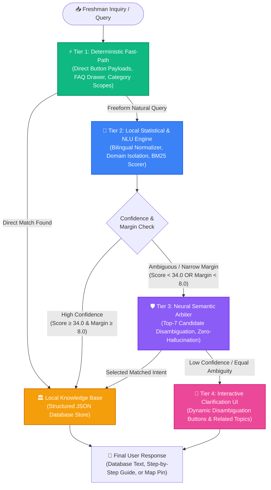

<div align="center">

  

  # 🎓 BukSU AI Chatbot & Campus Navigation System
  ### *Intelligent Conversational Onboarding & Campus Navigation Assistant for Incoming and First-Year Students at Bukidnon State University*

  <p align="center">
    <a href="#-target-audience--study-focus"></a>
    <a href="#-system-architecture"></a>
    <a href="#-technology-stack"></a>
    <a href="#-technology-stack"></a>
    <a href="#-technology-stack"></a>
    <a href="#-technology-stack"></a>
    <a href="#-technology-stack"></a>
    <a href="#-key-features"></a>
  </p>

  <p align="center">
    <strong>Freshman-Centered • Database-Backed Grounding • Zero-Hallucination • Offline-Resilient • Interactive GIS Navigation</strong>
  </p>

  <p align="center">
    <a href="#-system-overview">Overview</a> •
    <a href="#-target-audience--study-focus">Target Audience</a> •
    <a href="#-system-architecture">Architecture</a> •
    <a href="#-freshman-centered-features">Freshman Features</a> •
    <a href="#-technology-stack">Tech Stack</a> •
    <a href="#-quick-start--installation">Quick Start</a> •
    <a href="#-capstone-defense--technical-justification">Defense Guide</a>
  </p>

  ---
</div>

## 📌 System Overview

The **BukSU AI Chatbot** is a conversational agent and digital campus navigation assistant engineered specifically for **Bukidnon State University (BukSU)**. The primary focus of this capstone research is dedicated to **incoming first-year students and freshman students** undergoing academic and campus transition.

Incoming freshmen frequently face information barriers—such as navigating admission and enrollment procedures, understanding college academic and retention policies, finding student support offices, and locating unfamiliar buildings across the main campus. To solve these challenges, the system delivers instant, structured answers retrieved directly from a dedicated local database in natural **English, Cebuano (Bisaya), and Taglish**.

To ensure reliability without the hallucinations common in generative AI, the platform implements a **Hybrid Multi-Tier Cascade Retrieval Architecture**. This combines **deterministic fast-paths**, **statistical NLU (Rasa + BM25 Heuristic Scoring)**, and a **Neural Semantic Disambiguation Layer** that classifies user intent and retrieves responses directly from the knowledge database without generating unverified text.

---

## 🎯 Target Audience & Study Focus

This capstone study specifically focuses on **Incoming First-Year Students and First-Year Students (Freshmen)** of Bukidnon State University:

```
┌──────────────────────────────────────────────────────────────────────────────────┐
│                   PRIMARY TARGET AUDIENCE: FRESHMEN & INCOMING FIRST-YEARS       │
├────────────────────────────────────────┬─────────────────────────────────────────┤
│  🎓 Incoming First-Year Applicants     │  Freshmen Undergraduates (1st Year)     │
├────────────────────────────────────────┼─────────────────────────────────────────┤
│  • BukSU College Admission Test (CAT)  │  • First-Year Enrollment & SIAS Access  │
│  • Admission Ratings & Cut-off Scores  │  • College Retention & Grading Policies │
│  • Document & Medical Requirements     │  • Classroom, Lab & Office Navigation   │
│  • Program Offerings & Course Slots    │  • ID Processing & Student Services     │
└────────────────────────────────────────┴─────────────────────────────────────────┘
```

> **Academic Study Note**: While upperclassmen, faculty, and campus visitors can also benefit from the system, all conversational datasets, intent pipelines, and category drawers are curated and benchmarked around the **freshman transition lifecycle**.

---

## 🏛️ System Architecture: Hybrid Multi-Tier Cascade Pipeline

The chatbot uses a 4-tier cascade designed for sub-second responses, dialectal fluency, and zero hallucinations.



---

## 🔬 How the Cascade Pipeline Operates

| Tier | Component | Latency | Function & Logic for Freshmen |
| :--- | :--- | :---: | :--- |
| **Tier 1** | **⚡ Deterministic Fast-Path** | `0 ms` | Instantly processes category button clicks, FAQ drawer selections, and quick-reply payloads (`/direct_intent`) with **0ms latency** by pulling directly from the local database. |
| **Tier 2** | **🧠 Local Statistical & NLU Engine** | `10–30 ms` | • **Bilingual Normalizer**: Interprets natural Cebuano/Bisaya phrasing (e.g., *"unsaon pagpa enroll"*, *"asa ang comlab 1"*, *"nahagbong ko"*).<br>• **Domain Isolation**: Restricts search space to the student's active category (*Procedures*, *Academics*, *Services*, *University*, or *Location*).<br>• **BM25 Heuristic Matcher**: Scores subject terms, alias phrases, and program codes against database records.<br>• **Margin Gating**: Clear matches (**Score ≥ 34.0 & Margin ≥ 8.0**) return instantly from database without cloud inference. |
| **Tier 3** | **🛡️ Neural Semantic Arbiter** | `300–800 ms` | • **Targeted Activation**: Disambiguates long conversational stories or close candidate ties.<br>• **Zero-Hallucination Constraint**: Strictly evaluates Top-7 local database candidates and selects the matched `intent_id` (never generates unapproved text).<br>• **Domain-Scoped Cache**: Stores database mapping decisions to burn **0 tokens** on repeated questions.<br>• **Multi-Key Failover Pool**: Automatic round-robin rotation with health tracking and **3.5s timeout**. |
| **Tier 4** | **💬 Interactive Clarification UI** | `0 ms` | If a freshman query is broad (e.g., *"ID requirements"*), presents interactive disambiguation buttons (*"Student ID"* vs *"Library ID"*) for exact database selection. |

---

## ✨ Freshman-Centered Features

<div align="center">

| 🎓 Admissions & Enrollment | 🗺️ Interactive Campus Navigation | 📖 Academic Policies |
| :---: | :---: | :---: |
| Step-by-step guides for **BukSU-CAT**, rating results, document requirements, and first-year enrollment steps. | Interactive **Leaflet GIS map** pinpointing classrooms, ComLabs (1-8), faculty rooms, and cashier windows. | Clear explanations of **grading systems**, retention GPA, failed subject policies, and program shifting. |

| 🏥 Student Services Guide | 🗣️ Native Bisaya & Taglish | 🛡️ Zero-Hallucination Guarantee |
| :---: | :---: | :---: |
| Instant guidance for **Clinic & Dental** appointments, **Student ID** validation, Library cards, & Dorms. | Conversational understanding of everyday **Cebuano/Bisaya** and student colloquialisms. | All answers are pulled directly from the **structured local database**, preventing fabricated information. |

</div>

---

## 🛠️ Technology Stack

```
┌─────────────────────────────────────────────────────────────────────────────┐
│                                 FRONTEND                                    │
│   React 18  •  TypeScript  •  Vite  •  Tailwind CSS  •  Shadcn UI  • Leaflet  │
└──────────────────────────────────────┬──────────────────────────────────────┘
                                       │ REST / WebSockets
┌──────────────────────────────────────▼──────────────────────────────────────┐
│                               BACKEND SERVER                                │
│          Node.js  •  Express  •  TypeScript  •  Drizzle ORM  •  SQLite       │
└──────────────────────────────────────┬──────────────────────────────────────┘
                                       │ HTTP API (Port 5055 / 5005)
┌──────────────────────────────────────▼──────────────────────────────────────┐
│                         AI & NATURAL LANGUAGE CORE                          │
│   Rasa NLU  •  Statistical BM25 Scorer  •  Neural Semantic Arbiter Pool     │
│        Bilingual Normalizer  •  Multi-Key Failover  •  Hot-Reload Engine    │
└─────────────────────────────────────────────────────────────────────────────┘
```

- **Frontend Interface**: React 18, Vite, TypeScript, Tailwind CSS, Shadcn UI components, Lucide Icons, Leaflet / React-Leaflet GIS.
- **Application Server**: Node.js, Express, TypeScript, Drizzle ORM, SQLite database with structured audit logging.
- **NLU & AI Pipeline**: Python 3.8–3.10, Rasa Open Source (NLU & Action Server), Custom Multi-Tier Cascade Router.
- **Knowledge Core**: Modular JSON Knowledge Base with Hot-Reloading & Automated Backup Snapshots.
- **Speech Integration**: Web Speech API for voice recognition and spoken responses.

---

## 🚀 Quick Start & Installation

### 1. Prerequisites
- **Node.js**: `v18.0.0` or higher
- **Python**: `v3.8`, `v3.9`, or `v3.10`
- **Git**

### 2. Clone Repository & Install Dependencies
```bash
git clone https://github.com/Jaimortal/Chatbot_V3_RASABASED.git
cd Chatbot_V3_RASABASED

# Install frontend and server dependencies
npm install
```

### 3. Setup Python Virtual Environment (Rasa Core)
```bash
cd rasa
python -m venv venv

# Windows (Command Prompt or PowerShell)
.\venv\Scripts\activate

# Linux / macOS
source venv/bin/activate

# Install Python packages
pip install --upgrade pip
pip install rasa requests python-dotenv
cd ..
```

---

## ⚙️ Environment Configuration

Create a `.env` file in the root directory:

```env
# Server Configuration
PORT=5000
NODE_ENV=development
PYTHON_CMD=python

# Neural Semantic Arbiter Configuration
RASA_LLM_RERANKER_ENABLED=true
RASA_LLM_PROVIDER=groq
RASA_LLM_MODEL=llama-3.1-8b-instant
RASA_LLM_TIMEOUT_SECONDS=4.0
RASA_LLM_TOP_K=7
RASA_LLM_MAX_TOKENS=160

# Redundant Multi-Key Pools (comma-separated for automatic failover)
GROQ_API_KEYS=gsk_your_key_1,gsk_your_key_2
GEMINI_API_KEYS=AIzaSy_your_key_1
```

---

## 🖥️ Running the Full System

Run the following commands in **three separate terminal windows**:

```bash
# Terminal 1: Web Application & REST API (Port 5000)
npm run dev

# Terminal 2: Rasa Custom Action Routing Engine (Port 5055)
cd rasa && .\venv\Scripts\activate && rasa run actions --port 5055

# Terminal 3: Rasa NLU Core Server (Port 5005)
cd rasa && .\venv\Scripts\activate && rasa run --enable-api --cors "*" --port 5005
```

- **Student Chat Interface**: `http://localhost:5000`
- **Admin Knowledge Manager**: `http://localhost:5000/admin`

---

## 📂 Project Directory Structure

```
├── 📁 client/                     # Frontend Application (React + Vite + TS)
│   ├── 📁 src/
│   │   ├── 📁 components/         # Chat UI, GIS Leaflet maps, Category Drawers
│   │   ├── 📁 pages/              # Main Chat page, Map View, Admin Dashboard
│   │   └── 📁 lib/                # API communication & state management
│   └── 📁 public/                 # Static branding assets and campus media
├── 📁 server/                     # Node.js Express REST Backend
│   ├── 📁 controllers/            # Knowledge base management & audit trails
│   ├── 📁 routes/                 # Express API endpoints
│   └── 📄 index.ts                # Server entry point
├── 📁 rasa/                       # AI & Natural Language Engine
│   ├── 📁 actions/                # Cascade Routing & Scoring Algorithms
│   │   ├── 📄 knowledge_router.py # Central Multi-Tier Router
│   │   ├── 📄 retrieval_scorer.py # Statistical BM25 & Heuristic Matcher
│   │   ├── 📄 llm_reranker.py     # Neural Semantic Arbiter & Domain Cache
│   │   ├── 📄 llm_api_client.py   # Multi-Key Failover Client
│   │   ├── 📄 main_router.py      # Conversation Memory & Context Manager
│   │   ├── 📄 query_interpreter.py# Bilingual Tokenizer & Normalizer
│   │   └── 📁 knowledge/          # Curated Knowledge Base
│   │       ├── 📁 academics/      # Curricula, grading, retention policies
│   │       ├── 📁 procedures/     # Enrollment, clearance, admission steps
│   │       ├── 📁 services/       # Clinic, library, ICT, dorms, registrar
│   │       ├── 📁 university/     # History, administration, vision, mission
│   │       └── 📁 location/       # Building coordinates, floor directories
│   ├── 📄 domain.yml              # Rasa domain definitions
│   └── 📄 config.yml              # Rasa NLU pipeline configuration
├── 📁 docs/                       # Capstone Defense Guides & Audit Reports
└── 📄 README.md                   # System Documentation
```

---

## 🎓 Capstone Defense & Technical Justification

Use these architectural justifications during academic evaluations:

<details>
<summary><b>🎯 Q1: Why is this study specifically focused on Incoming and First-Year Students?</b></summary>
<br>

> **Defense Response**:
> *"Incoming first-year students and freshmen experience the highest rate of **administrative confusion, orientation anxiety, and physical campus disorientation**. 
> 
> Unlike upperclassmen who are already familiar with college procedures, incoming students frequently struggle with:
> 1. Understanding entrance examination ratings and cut-off scores (BukSU-CAT).
> 2. Step-by-step freshman enrollment requirements and clearance processes.
> 3. College retention policies, prerequisites, and GPA grading computations.
> 4. Physically locating classrooms, laboratories, and administrative desks on campus.
> 
> By focusing our conversational dataset, domain isolation filters, and GIS mapping on the freshman onboarding lifecycle, our system delivers the highest practical impact."*
</details>

<details>
<summary><b>💬 Q2: Why use a Hybrid Cascade Architecture instead of a pure generative LLM?</b></summary>
<br>

> **Defense Response**:
> *"Pure generative models introduce serious risks: **hallucinations**, unpredictable latency (2–5 seconds per turn), recurring API costs, and total failure if rate-limited.
> 
> Our **Hybrid Cascade Retrieval** architecture provides the best of both worlds:
> 1. **Direct Database Grounding**: Outputs are fetched directly from structured database records, preventing generative speculation.
> 2. **Instant Performance**: Over 80% of student queries run 100% locally in **0 to 30ms**.
> 3. **Deep Semantic Understanding**: The neural arbiter is used *strictly as a semantic classifier* to resolve complex Bisaya narratives without generating unverified text."*
</details>

<details>
<summary><b>📶 Q3: What happens if campus internet connection is slow or drops?</b></summary>
<br>

> **Defense Response**:
> *"The system is engineered with **Graceful Degradation and Strict Timeouts**:
> 1. All core database records, campus maps, and Rasa NLU models reside locally on the host server.
> 2. The cloud arbiter has an aggressive **3.5-second timeout limit**. If the network stalls, the request immediately aborts.
> 3. The system automatically falls back to local heuristic ranking and presents interactive clarification buttons with **zero downtime or crashes**."*
</details>

<details>
<summary><b>🔒 Q4: How is student data privacy and security handled?</b></summary>
<br>

> **Defense Response**:
> *"The system is built on **Zero Personal Data Exposure**:
> 1. Queries sent to the semantic arbiter contain only anonymized user text and candidate topic titles.
> 2. No student ID numbers, passwords, academic grades, or personal identifiers are ever transmitted to external APIs.
> 3. All administrative authentication and audit logging run on an isolated, local SQLite database."*
</details>

---

## 👥 Development Team & Acknowledgments

- **Development Team**: BukSU BSIT Capstone Development Team
- **Institution**: Bukidnon State University (BukSU)
- **Department**: College of Technologies — Information Technology Department

---

<div align="center">
  <sub>Developed for Bukidnon State University • Educational & Institutional Capstone Project Focused on Freshman Onboarding</sub>
</div>
