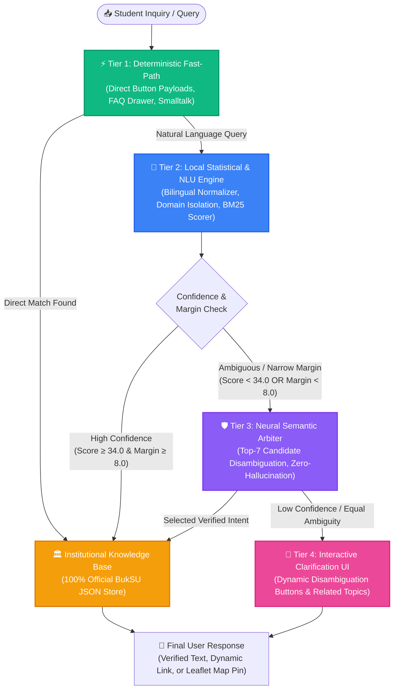

<div align="center">

  

  # 🎓 BukSU AI Chatbot & Campus Navigation System
  ### *Intelligent Hybrid Multi-Tier Cascade Conversational Agent for Bukidnon State University*

  <p align="center">
    <a href="#-system-architecture"></a>
    <a href="#-technology-stack"></a>
    <a href="#-technology-stack"></a>
    <a href="#-technology-stack"></a>
    <a href="#-technology-stack"></a>
    <a href="#-technology-stack"></a>
    <a href="#-key-features"></a>
  </p>

  <p align="center">
    <strong>Fast • 100% University Verified • Zero-Hallucination • Offline-Resilient • Interactive GIS Navigation</strong>
  </p>

  <p align="center">
    <a href="#-system-overview">Overview</a> •
    <a href="#-system-architecture">Architecture</a> •
    <a href="#-key-features">Key Features</a> •
    <a href="#-technology-stack">Tech Stack</a> •
    <a href="#-quick-start--installation">Quick Start</a> •
    <a href="#-project-structure">Structure</a> •
    <a href="#-capstone-defense--technical-justification">Defense Guide</a>
  </p>

  ---
</div>

## 📌 System Overview

The **BukSU AI Chatbot** is a university-grade conversational assistant and digital campus directory engineered for **Bukidnon State University (BukSU)**. Designed to serve prospective students, enrolled undergraduates, faculty, and campus visitors, the chatbot resolves inquiries across academic policies, admissions, enrollment workflows, student services, and university administration.

To provide instant, reliable answers without the inaccuracies common in standard generative AI, the platform implements a **Hybrid Multi-Tier Cascade Retrieval Architecture**. This integrates **deterministic routing**, **statistical natural language understanding (Rasa NLU + BM25 Heuristic Scoring)**, and an advanced **Neural Semantic Disambiguation Layer** that strictly classifies and retrieves verified institutional data without generating unapproved text.

---

## 🏛️ System Architecture

The core of the system is a **4-Tier Cascade Retrieval Pipeline** built for sub-second execution, dialectal fluency, and zero hallucinations.



---

## 🔬 How the Cascade Pipeline Operates

| Tier | Component | Latency | Function & Logic |
| :--- | :--- | :---: | :--- |
| **Tier 1** | **⚡ Deterministic Fast-Path** | `0 ms` | Intercepts structured GUI interactions, Quick-Reply buttons, Category Drawers, and exact `/direct_intent` payloads. Returns verified data immediately with zero compute. |
| **Tier 2** | **🧠 Local Statistical & NLU Engine** | `10–30 ms` | • **Bilingual Normalizer**: Expands Cebuano/Bisaya colloquialisms, slang, and English stems.<br>• **Domain Isolation**: Restricts search space to active category (e.g. *Procedures*, *Academics*, *Services*, *University*, *Location*).<br>• **BM25 Heuristic Matcher**: Scores subject terms, alias phrases, display titles, and child attributes.<br>• **Margin Gating**: Queries scoring **≥ 34.0 with margin ≥ 8.0 pts** over runner-up are delivered instantly. |
| **Tier 3** | **🛡️ Neural Semantic Arbiter** | `300–800 ms` | • **Targeted Activation**: Only called for ambiguous phrasing, long conversational narratives, or narrow-margin candidate ties.<br>• **Zero-Hallucination Constraint**: Evaluates Top-7 local candidates. Returns strictly an official `intent_id` (never generates unverified facts).<br>• **Domain-Scoped Cache**: Caches verified decisions to burn **0 tokens** on recurring queries.<br>• **Multi-Key Failover Pool**: Automatic round-robin rotation with health tracking and **3.5s timeout**. |
| **Tier 4** | **💬 Interactive Clarification UI** | `0 ms` | If queries remain ambiguous across multiple departments, renders interactive disambiguation buttons (*"Did you mean Student ID or Library ID?"*) to guarantee 100% user alignment. |

---

## ✨ Key Features

<div align="center">

| 🗣️ Bilingual Intelligence | 🗺️ Interactive GIS Mapping | 📚 Domain Scopes |
| :---: | :---: | :---: |
| Native understanding of English, natural **Cebuano/Bisaya**, and colloquial **Taglish** student slang. | Real-time **Leaflet map rendering** with building pins, faculty office finders, and floor directories. | Isolated contextual browsing across **Procedures**, **Academics**, **Services**, **University**, & **Locations**. |

| 🛡️ Zero-Hallucination | ⚡ 100% Local Fast-Path | 📊 Live Admin Knowledge Hub |
| :---: | :---: | :---: |
| Institutional facts are retrieved **strictly from verified university records**, eliminating fabricated answers. | **80%+ of typical inquiries** execute locally in under 30ms, ensuring full offline functionality. | Real-time administrative dashboard for editing topics, answers, keywords, map pins, and audit logs. |

</div>

---

## 🛠️ Technology Stack

```
┌─────────────────────────────────────────────────────────────────────────────┐
│                                 FRONTEND                                    │
│   React 18  •  TypeScript  •  Vite  •  Tailwind CSS  •  Shadcn UI  • Leaflet  │
└──────────────────────────────────────┬──────────────────────────────────────┘
                                       │ REST / WebSockets
┌──────────────────────────────────────▼──────────────────────────────────────┐
│                               BACKEND SERVER                                │
│          Node.js  •  Express  •  TypeScript  •  Drizzle ORM  •  SQLite       │
└──────────────────────────────────────┬──────────────────────────────────────┘
                                       │ HTTP API (Port 5055 / 5005)
┌──────────────────────────────────────▼──────────────────────────────────────┐
│                         AI & NATURAL LANGUAGE CORE                          │
│   Rasa NLU  •  Statistical BM25 Scorer  •  Neural Semantic Arbiter Pool     │
│        Bilingual Normalizer  •  Multi-Key Failover  •  Hot-Reload Engine    │
└─────────────────────────────────────────────────────────────────────────────┘
```

- **Frontend Client**: React 18, Vite, TypeScript, Tailwind CSS, Shadcn UI components, Lucide Icons, Leaflet / React-Leaflet GIS.
- **Application Server**: Node.js, Express, TypeScript, Drizzle ORM, SQLite database with structured audit trail logging.
- **NLU & AI Pipeline**: Python 3.8–3.10, Rasa Open Source (NLU & Action Server), Custom Multi-Tier Cascade Router.
- **Knowledge Core**: Modular JSON Knowledge Base with Hot-Reloading & Automated Backup Snapshots.
- **Speech Integration**: Web Speech API for voice recognition and text-to-speech feedback.

---

## 🚀 Quick Start & Installation

### 1. Prerequisites
- **Node.js**: `v18.0.0` or higher
- **Python**: `v3.8`, `v3.9`, or `v3.10`
- **Git**

### 2. Clone Repository & Install Dependencies
```bash
git clone https://github.com/Jaimortal/Chatbot_V3_RASABASED.git
cd Chatbot_V3_RASABASED

# Install Node.js frontend and backend dependencies
npm install
```

### 3. Setup Python Virtual Environment (Rasa Core)
```bash
cd rasa
python -m venv venv

# Windows (Command Prompt or PowerShell)
.\venv\Scripts\activate

# Linux / macOS
source venv/bin/activate

# Install Python packages
pip install --upgrade pip
pip install rasa requests python-dotenv
cd ..
```

---

## ⚙️ Environment Configuration

Create a `.env` file in the root directory:

```env
# Server Configuration
PORT=5000
NODE_ENV=development
PYTHON_CMD=python

# Neural Semantic Arbiter Configuration
RASA_LLM_RERANKER_ENABLED=true
RASA_LLM_PROVIDER=groq
RASA_LLM_MODEL=llama-3.1-8b-instant
RASA_LLM_TIMEOUT_SECONDS=4.0
RASA_LLM_TOP_K=7
RASA_LLM_MAX_TOKENS=160

# Redundant Multi-Key Pools (comma-separated for automatic failover)
GROQ_API_KEYS=gsk_your_key_1,gsk_your_key_2
GEMINI_API_KEYS=AIzaSy_your_key_1
```

---

## 🖥️ Running the Full System

Run the following commands across **three separate terminal windows**:

```bash
# Terminal 1: Web Application & REST API (Port 5000)
npm run dev

# Terminal 2: Rasa Custom Action Routing Engine (Port 5055)
cd rasa && .\venv\Scripts\activate && rasa run actions --port 5055

# Terminal 3: Rasa NLU Core Server (Port 5005)
cd rasa && .\venv\Scripts\activate && rasa run --enable-api --cors "*" --port 5005
```

- **Student Chat Interface**: `http://localhost:5000`
- **Admin Knowledge Manager**: `http://localhost:5000/admin`

---

## 📂 Project Directory Structure

```
├── 📁 client/                     # Frontend Application (React + Vite + TS)
│   ├── 📁 src/
│   │   ├── 📁 components/         # Chat UI, GIS Leaflet maps, Category Drawers
│   │   ├── 📁 pages/              # Main Chat page, Map View, Admin Dashboard
│   │   └── 📁 lib/                # API communication & state management
│   └── 📁 public/                 # Static branding assets and campus media
├── 📁 server/                     # Node.js Express REST Backend
│   ├── 📁 controllers/            # Knowledge base management & audit trails
│   ├── 📁 routes/                 # Express API endpoints
│   └── 📄 index.ts                # Server entry point
├── 📁 rasa/                       # AI & Natural Language Engine
│   ├── 📁 actions/                # Cascade Routing & Scoring Algorithms
│   │   ├── 📄 knowledge_router.py # Central Multi-Tier Router
│   │   ├── 📄 retrieval_scorer.py # Statistical BM25 & Heuristic Matcher
│   │   ├── 📄 llm_reranker.py     # Neural Semantic Arbiter & Domain Cache
│   │   ├── 📄 llm_api_client.py   # Multi-Key Failover Client
│   │   ├── 📄 main_router.py      # Conversation Memory & Context Manager
│   │   ├── 📄 query_interpreter.py# Bilingual Tokenizer & Normalizer
│   │   └── 📁 knowledge/          # Official Institutional Knowledge Base
│   │       ├── 📁 academics/      # Curricula, grading, retention policies
│   │       ├── 📁 procedures/     # Enrollment, clearance, admission steps
│   │       ├── 📁 services/       # Clinic, library, ICT, dorms, registrar
│   │       ├── 📁 university/     # History, administration, vision, mission
│   │       └── 📁 location/       # Building coordinates, floor directories
│   ├── 📄 domain.yml              # Rasa domain definitions
│   └── 📄 config.yml              # Rasa NLU pipeline configuration
├── 📁 docs/                       # Capstone Defense Guides & Audit Reports
└── 📄 README.md                   # System Documentation
```

---

## 🎓 Capstone Defense & Technical Justification

Use these architectural justifications during academic evaluations:

<details>
<summary><b>💬 Q1: Why use a Hybrid Cascade Architecture instead of a pure generative LLM?</b></summary>
<br>

> **Defense Response**:
> *"Pure generative models introduce serious risks in institutional settings: **hallucinations**, outdated policy claims, high latency (2–5 seconds per turn), recurring API costs, and total failure if rate-limited.
> 
> Our **Hybrid Cascade Retrieval** architecture provides the best of both worlds:
> 1. **100% Verified Accuracy**: Outputs are fetched directly from official institutional JSON records.
> 2. **Instant Performance**: Over 80% of student queries run 100% locally in **0 to 30ms**.
> 3. **Deep Semantic Understanding**: The neural arbiter is used *strictly as a semantic classifier* to resolve complex Bisaya narratives without generating unverified text."*
</details>

<details>
<summary><b>📶 Q2: What happens if campus internet connection is slow or drops?</b></summary>
<br>

> **Defense Response**:
> *"The system is engineered with **Graceful Degradation and Strict Timeouts**:
> 1. All core knowledge records, campus maps, and Rasa NLU models reside **100% locally on the host server**.
> 2. The cloud arbiter has an aggressive **3.5-second timeout limit**. If the network stalls, the request immediately aborts.
> 3. The system automatically falls back to local heuristic ranking and presents interactive clarification buttons with **zero downtime or crashes**."*
</details>

<details>
<summary><b>🔒 Q3: How is student data privacy and security handled?</b></summary>
<br>

> **Defense Response**:
> *"The system is built on **Zero Personal Data Exposure**:
> 1. Queries sent to the semantic arbiter contain only anonymized user text and candidate topic titles.
> 2. No student ID numbers, passwords, academic grades, or personal identifiers are ever transmitted to external APIs.
> 3. All administrative authentication and audit logging run on an isolated, local SQLite database."*
</details>

---

## 👥 Development Team & Acknowledgments

- **Development Team**: BukSU BSIT Capstone Development Team
- **Institution**: Bukidnon State University (BukSU)
- **Department**: College of Technologies — Information Technology Department

---

<div align="center">
  <sub>Developed for Bukidnon State University • Educational & Institutional Capstone Project</sub>
</div>
