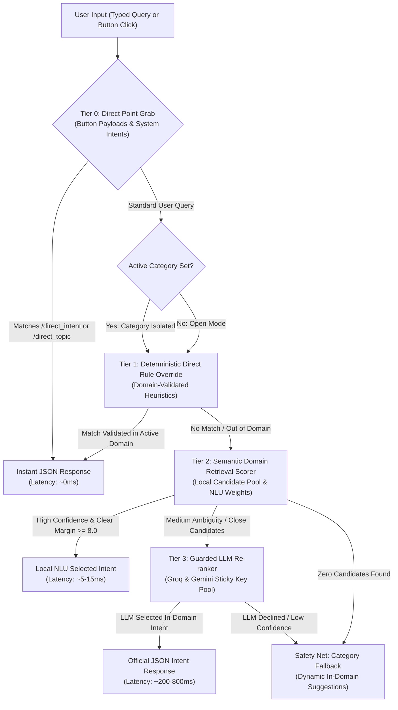

# BukSU AI Chatbot — Multi-Tier System Architecture & Routing Pipeline

---

## 📌 1. System Overview

The BukSU AI Chatbot operates on a **High-Precision Multi-Tier Hybrid Architecture** designed to maximize response accuracy, eliminate cross-topic overlapping, and deliver low latency across both typed queries and interactive UI button selections.

The pipeline combines:
1. **Zero-Latency Direct Payloads** for UI buttons and category suggestions.
2. **Deterministic Domain-Isolated Rules** for high-confidence student queries.
3. **Local Semantic Retrieval Scoring (Rasa NLU Scorer)** for fast candidate ranking.
4. **A Guarded LLM Re-ranker Pool (Groq & Gemini)** for ambiguous queries without hallucination risk.
5. **Category-Isolated Safety Nets** for unknown queries.

---

## 🏗️ 2. Architectural Flow Diagram



---

## 🔍 3. Comprehensive Tier-by-Tier In-Depth Breakdown

---

### 🔹 Tier 0: Direct Point Data Grab (Pre-Router Fast Path)

#### 🎯 Main Purpose & Role
Tier 0 serves as the **zero-latency bypass highway** for all deterministic UI interactions. Its primary role is to immediately fulfill requests where the exact intended database record is already known with 100% certainty (e.g., when a user clicks a quick-reply suggestion button, navigation chip, or category link).

#### ⚙️ How It Works (Internal Mechanics)
1. When a message arrives, Tier 0 inspects the raw payload before any natural language processing occurs.
2. It detects structured protocol headers:
   * `/direct_intent{"intent":"<target_intent>"}`
   * `/direct_topic{"topic":"<target_topic>"}`
   * `/<intent_name>`
3. Using regular expressions, it extracts the exact target intent ID (e.g., `location_ATM` or `freshman_enrollment_process`).
4. It directly pulls the structured JSON answer, map pins, routes, and suggestion buttons from the database hash table in memory.
5. It returns the response immediately to the user.

#### 🔗 Relationship to Other Tiers
* **Preempts Tier 1, 2, and 3**: If a payload matches Tier 0, the query completely skips Tier 1 (Rules), Tier 2 (Scorer), and Tier 3 (LLM), avoiding all NLP overhead.
* **Hand-off to Tier 1**: If the message is regular typed text (no payload prefix), Tier 0 passes the query directly to Tier 1.

#### 🛡️ How It Boosts Accuracy
* **100% Deterministic Precision**: Completely eliminates the possibility of NLU misclassification when clicking UI buttons.
* **Cross-Category Map Pin Reliability**: Enables suggestion buttons in categories like *Other Services* to immediately pull exact location pins from the *Location* database without breaking category isolation for typed text.
* **0ms Latency**: Delivers instant responses with zero server lag.

#### 💡 Real-World Examples
* User clicks button **[ATM location]** &rarr; Payload `/direct_intent{"intent":"location_ATM"}` &rarr; Returns ATM location description and map pin instantly.
* User clicks button **[COB SBO Office]** &rarr; Payload `/direct_intent{"intent":"location_COB_SBO_Office"}` &rarr; Returns COB SBO Office pin directly.

---

### 🔹 Tier 1: Deterministic Direct Rule Overrides (High-Precision Heuristics)

#### 🎯 Main Purpose & Role
Tier 1 handles unambiguous, high-frequency student questions that have distinct university keywords (e.g., *“what is the grading system”*, *“who is the dean of COT”*, *“dress code policy”*). Its role is to deliver instant, 100% accurate answers for known institutional policies without waiting for semantic scoring or external LLM calls.

#### ⚙️ How It Works (Internal Mechanics)
1. Normalizes the user query across English and Cebuano/Bisaya (e.g., expanding abbreviations, handling spelling variants like *“unsaon”*, *“pila”*, *“tagpila”*).
2. Evaluates specialized, highly specific regex rules and token patterns.
3. **Domain Validation Check**: Before accepting a matched intent, Tier 1 calls:
   ```python
   self.data_loader.is_intent_in_domain(raw_intent, active_domain)
   ```
4. **Validation Logic**:
   * If `active_domain` is set and the matched intent **belongs to that domain** &rarr; The response is delivered immediately.
   * If `active_domain` is set but the matched intent **belongs to another domain** (e.g., asking about ID procedures while inside Location) &rarr; Tier 1 **rejects the match (`None`)** to protect category boundaries.
   * If in Open Mode (no category set) &rarr; The rule is delivered directly.

#### 🔗 Relationship to Other Tiers
* **Preempts Tier 2 and Tier 3**: A successful Tier 1 match fulfills the query in 1–5ms, bypassing Layer 2 semantic scoring and Layer 3 LLM calls.
* **Hand-off to Tier 2**: If no rule matches (or if a rule was rejected due to domain isolation), the query cleanly falls through to Tier 2 for semantic candidate search.

#### 🛡️ How It Boosts Accuracy
* **Zero Cross-Category Bleed**: Out-of-category rules are blocked before they can corrupt the active category.
* **Grammar & Slang Invariance**: Regex handles diverse student phrasings (e.g., *"unsa ang dresscode"*, *"civilian clothes policy"*, *"without uniform"* all reliably trigger `campus_dress_code_policy`).
* **Instantaneous 1-5ms Speed**: Solves >60% of common university queries locally on the CPU.

#### 💡 Real-World Examples
* Inside **Academics**: *"what is the grading system"* &rarr; Matches `buksu_grading_system` &rarr; In-domain validated &rarr; Returns grading scale.
* Inside **Location**: *"what is the grading system"* &rarr; Matches `buksu_grading_system` &rarr; Out-of-domain rejected (`None`) &rarr; Falls through to Location fallback.

---

### 🔹 Tier 2: Semantic Domain Retrieval & Local NLU Scoring (Rasa Scorer)

#### 🎯 Main Purpose & Role
Tier 2 is the **local semantic brain** of the chatbot. When a user asks a question that does not match a hardcoded Tier 1 rule, Tier 2 searches the structured JSON knowledge base to find the best candidate intents within the active domain, scoring each candidate using a multi-factor weighting algorithm.

#### ⚙️ How It Works (Internal Mechanics)
1. **Candidate Pool Isolation**: Pulls candidate entries strictly from the active category:
   ```python
   candidate_pool = self.index.candidates_for_domain(active_domain)
   ```
2. **Multi-Factor Feature Scoring**:
   * **Exact Phrase Match (+36.0 pts)**: User query exactly matches an example phrase in the JSON metadata.
   * **Subject Term Match (+18.0 pts)**: Exact match on subject nouns (e.g., *"honorable dismissal"*, *"transcript of records"*).
   * **Strong Keyword & Token Overlap (+10.0 pts)**: Overlap on essential identifying keywords.
   * **Purpose Alignment (+8.0 pts)**: The query intent purpose (`ask_requirement`, `ask_fee`, `ask_schedule`, `ask_process`) aligns with the candidate's topic type.
   * **Purpose Mismatch Penalty (-12.0 pts)**: Penalizes candidates when the user asks for a *process* but the candidate is a *fee*, or vice-versa.
3. **Decision & Confidence Gating**:
   * **High Confidence Takeover**: If the top score $\ge 34.0$ pts AND the lead over the runner-up is $\ge 8.0$ pts margin &rarr; **Local NLU takes over** and returns the response immediately (~5–15ms).
   * **Ambiguous / Close Contest**: If the top score is medium ($22.0 – 34.0$ pts) or the runner-up is within $< 8.0$ pts &rarr; Escalates to **Tier 3 (LLM Re-ranker)**.
   * **Zero Score**: If no candidates score $> 0$ pts &rarr; Escalates to the **Category Fallback Safety Net**.

#### 🔗 Relationship to Other Tiers
* **Follows Tier 1**: Receives queries that were not resolved deterministically by Tier 1.
* **Feeds Tier 3**: When ambiguity exists, Tier 2 pre-filters and ranks the top candidates, providing Tier 3 with a clean, scoped candidate list.

#### 🛡️ How It Boosts Accuracy
* **Mathematical Disambiguation**: The 8.0-point margin threshold prevents close, competitive candidates from guessing locally.
* **Zero Out-of-Domain Candidates**: Because `candidate_pool` is strictly domain-filtered, candidates from other categories are physically impossible to score.
* **Sub-20ms Execution**: Evaluates hundreds of candidates locally on CPU without external API calls.

#### 💡 Real-World Examples
* Query: *"what papers do i need for graduation clearance"* &rarr; Matches phrases and subject terms with score `42.5` (runner-up `18.0`, margin `24.5`) &rarr; **High Confidence Local NLU Takeover** &rarr; Returns clearance requirements in 8ms.
* Query: *"how long does admission take"* &rarr; Candidate 1 (`admission_processing_time`: `28.0`) vs Candidate 2 (`exam_schedule`: `25.5`) &rarr; Margin `2.5` &rarr; Escalates to **Tier 3 LLM** for intelligent disambiguation.

---

### 🔹 Tier 3: Guarded LLM Re-ranker & Intent Disambiguation

#### 🎯 Main Purpose & Role
Tier 3 acts as the **intelligent arbiter** for complex, informal, or ambiguously phrased student queries that Tier 2 could not resolve with decisive confidence. It leverages state-of-the-art LLMs (Groq LPU with Gemini fallback) to understand student context, grammar nuances, and intent.

#### ⚙️ How It Works (Internal Mechanics)
1. **Guarded Prompt Construction**:
   * Tier 3 builds a constrained prompt containing the user query and the top 3–5 candidate intents selected by Tier 2.
   * System Prompt strictly enforces: *"Choose the single best matching intent ID from the provided list, or return 'None'. Return strictly valid JSON."*
2. **Multi-Key Sticky Sequential Rotation**:
   * **Active Key Stickiness**: Starts on **Groq Key 1** and stays on Key 1 for all requests as long as it succeeds.
   * **1-Minute Cooldown on Limit**: If Key 1 hits HTTP 429 (rate limit) or an error, **only Key 1** is placed on a 60-second cooldown, and the cursor advances to **Groq Key 2**.
   * **Sequential Advancement**: Key 2 remains sticky for subsequent queries until Key 2 limits out &rarr; advances to **Key 3** &rarr; **Key 4** &rarr; **Key 5**.
   * **Gemini Automatic Failover**: If all 5 Groq keys are currently on cooldown, Tier 3 automatically fails over to **Gemini API keys** (**Key 1 &rarr; Key 2 &rarr; Key 3**) using the same sticky sequential logic.
3. **Response Validation**:
   * Tier 3 parses the LLM JSON output. If the selected intent is in the approved candidate list, the official JSON database answer for that intent is returned.
   * If the LLM returns `"None"` or an unlisted intent, Tier 3 declines and passes control to the Category Fallback.

#### 🔗 Relationship to Other Tiers
* **Follows Tier 2**: Operates only on candidates pre-screened and pre-ranked by Tier 2.
* **Safety Hand-off**: If the LLM declines or fails across all keys, Tier 3 falls back gracefully to the Category Safety Net.

#### 🛡️ How It Boosts Accuracy
* **Zero Hallucination Guarantee**: The LLM **never writes answers**. It only selects an intent key, ensuring 100% of answer text, map pins, and links come from verified BukSU data.
* **Handles Complex Phrasing & Slang**: Accurately disambiguates colloquial student questions (e.g., *"pwede ba makasulod bisan walay uniform kay naay exam"* &rarr; accurately picks `campus_dress_code_policy`).
* **High Availability**: 8 total API keys (5 Groq + 3 Gemini) with 60s cooldowns guarantee 24/7 reliability without rate-limit downtime.

#### 💡 Real-World Examples
* Query: *"can i still validate my enrollment if my COR has no signature"* &rarr; Tier 2 passes `cor_validation_steps` and `enrollment_general_process` &rarr; Groq selects `cor_validation_steps` &rarr; Returns exact COR validation instructions.

---

### 🔹 Safety Net: Category-Isolated Fallback & Dynamic Suggestions

#### 🎯 Main Purpose & Role
The Safety Net is the **graceful failure handler**. When a user's query cannot be answered by any tier (or when an out-of-category question is asked), it prevents dead ends by informing the user politely and providing relevant interactive suggestion buttons.

#### ⚙️ How It Works (Internal Mechanics)
1. Formats a polite category-specific message:
   > *"I couldn't find a matching answer for that in **[Active Category Name]**.*  
   > *You can try asking about:"*
2. Dynamically extracts the top 3 closest in-domain topics from the candidate pool or default starter topics for that domain.
3. Renders these topics as clickable suggestion buttons so the user can easily discover available information.

#### 🔗 Relationship to Other Tiers
* Sits at the very end of the pipeline. Triggered only when Tier 0, 1, 2, and 3 produce no valid in-domain match.

#### 🛡️ How It Boosts Accuracy
* **Prevents False Positives**: Rather than guessing incorrectly when confidence is low, it safely presents suggestion options, keeping the chatbot's precision rate high.
* **Guided User Discovery**: Directs students to legitimate topics available within that specific department or category.

---

## 📊 4. Tier Performance & Metric Comparison

| Tier | Component Name | Execution Latency | Decision Type | Failover / Hand-off Target |
| :--- | :--- | :---: | :---: | :--- |
| **Tier 0** | Direct Point Grab | **< 1ms** | Deterministic Payload Lookup | Tier 1 (if plain text) |
| **Tier 1** | Direct Rule Override | **1 – 5ms** | Regex / Token Heuristic Match | Tier 2 (if no rule match) |
| **Tier 2** | Semantic Retrieval Scorer | **5 – 15ms** | Weighted Semantic Candidate Scoring | Tier 3 (if margin < 8.0) |
| **Tier 3** | Guarded LLM (Groq) | **200 – 450ms** | Contextual Intent Selection | Gemini Key Pool (on 429) |
| **Tier 3 Fallback** | Guarded LLM (Gemini) | **600 – 1200ms** | Contextual Intent Selection | Safety Net Fallback |
| **Safety Net** | Category Fallback | **< 2ms** | Dynamic Suggestion Generation | User Interaction |

---

## 🗂️ 5. Domain Knowledge Partitioning Matrix

| Domain ID | Category Display Title | Structured Knowledge Sources | Domain Responsibility |
| :--- | :--- | :--- | :--- |
| `location` | **Campus Navigation & Locations** | `responses_location_core.json` | 213+ rooms, offices, laboratories, building floor directories, GPS pins, and multi-point route maps. |
| `procedures` | **Procedures & Guides** | `admission_procedures.json`<br/>`enrollment_procedures.json`<br/>`student_service_procedures.json` | Step-by-step admissions, online enrollment, ID processing, COR validation, and grade completion. |
| `academics` | **Academic Policies & Courses** | `academic_transactions.json`<br/>`degree_programs.json` | Grading system, Dean's List, academic retention, graduation clearance, and degree program lists. |
| `services` | **Student Services & Facilities** | `clinic_services.json`<br/>`oss_student_services.json` | Medical & Dental clinic, SFGU scholarships, SBO student organizations, and student counseling. |
| `university` | **University Info & Directory** | `faculty_and_deans.json`<br/>`university_identity.json` | University leadership, Deans of Colleges, dress code policy, BukSU identity, vision, and core values. |
| `others` | **Other Services & Inquiries** | `facilities_and_other_inquiries.json` | Campus facility availability (ATM, Library, Gym, Dormitories, Museum, Cafeteria, Guard House). |

---

## 🛡️ 6. Core Architectural Guardrails Summary

1. **Strict Category Isolation**: Tier 1 rules and Tier 2 candidate pools are strictly scoped by `active_domain`. Cross-category queries cannot leak across domain boundaries.
2. **Zero Hallucination Constraint**: The LLM is restricted to a classification role (selecting registered intent IDs), ensuring 100% of answer content is verified university data.
3. **Resilient Key Rotation Engine**: 5 Groq keys + 3 Gemini keys with sticky sequential rotation and 1-minute cooldowns eliminate rate limit downtime.
4. **Bilingual Natural Language Support**: Seamlessly processes both English and Cebuano/Bisaya phrasing across all tiers.
