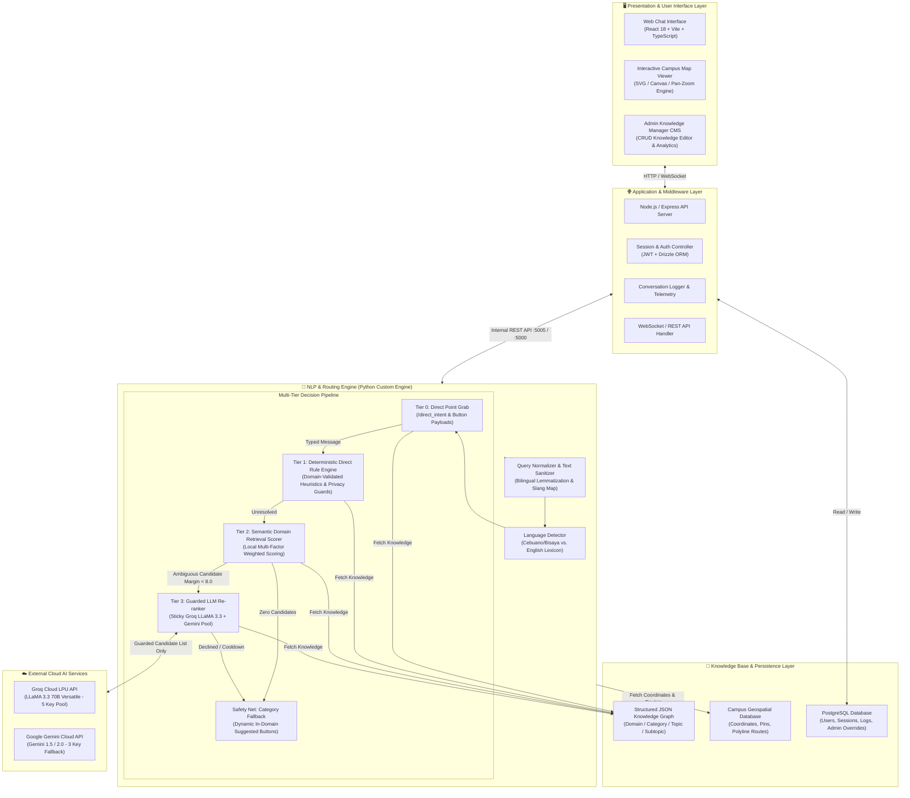
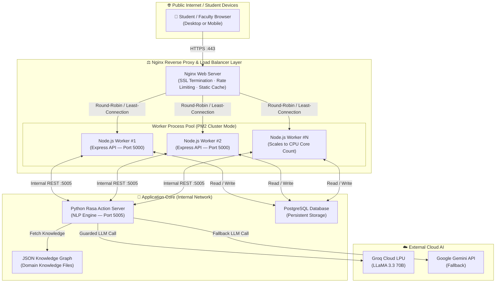

# BukSU AI Chatbot — System Architecture & Technology Stack

---

## 📌 1. System Architecture Overview

The BukSU AI Chatbot operates on a **High-Precision Multi-Tier Hybrid Architecture** that combines deterministic heuristic rules, local semantic retrieval scoring, a guarded external Large Language Model (LLM) reranker, and an interactive GIS campus mapping engine.

This architecture is specifically designed for institutional university information systems to solve three critical challenges:
1. **Zero Hallucination Guarantee:** The chatbot never allows an LLM to generate or invent university policy text; all official answers originate from curated institutional knowledge records.
2. **Category Isolation:** Prevents cross-topic semantic bleed (e.g., asking about admission requirements while exploring campus facilities).
3. **Bilingual Real-Time Processing:** Dynamically handles English and Cebuano/Bisaya queries with sub-second response times.

---

## 🏗️ 2. System Architecture Diagram



---

## 📋 3. Layer-by-Layer Narrative & Technology Breakdown

### Layer 1: Presentation & User Interface (Frontend)
* **What happens at this layer:**  
  The user interface presents students, faculty, and guests with a modern, responsive conversational chat widget and an embedded BukSU campus navigation map. Users can type questions in English or Bisaya, click topic discovery quick-reply buttons, navigate categorical menus, and view pins and walking paths overlaid on campus buildings. Administrators use a protected CMS dashboard to manage responses, review telemetry logs, and test queries.
* **Specific Technologies:**
  * **Core Framework:** React 18 with TypeScript for type safety and reactive state management.
  * **Build Tool:** Vite for ultra-fast Hot Module Replacement (HMR) and optimized production bundles.
  * **Styling & Design System:** Tailwind CSS, Radix UI Primitives, Lucide React Icons.
  * **Interactive Map Engine:** Custom SVG/Canvas Vector Rendering Engine with coordinate transformation, pinch-to-zoom, pan, and real-time pin/route animations.

---

### Layer 2: Application & Middleware (Backend Gateway)
* **What happens at this layer:**  
  Acts as the secure orchestrator between client interfaces, database persistence, and Python NLP action services. It handles user session management, rate-limiting, administrative authentication, conversational telemetry logging, and routes messages to the NLP engine.
* **Specific Technologies:**
  * **Runtime Environment:** Node.js (v18+ LTS) with Express.js.
  * **Database ORM:** Drizzle ORM connecting to PostgreSQL.
  * **API Protocols:** RESTful JSON APIs and WebSockets for real-time bidirectional message streaming.
  * **Security & Auth:** JSON Web Tokens (JWT), Argon2/Bcrypt password hashing, CORS middleware, and input sanitization.

---

### Layer 3: NLP & Routing Engine (Python Custom Intelligence Core)
* **What happens at this layer:**  
  The query is normalized, sanitized, and evaluated across a 4-tier decision hierarchy. Language detection identifies whether the student is writing in English or Cebuano/Bisaya. The engine executes deterministic rules first, falls back to multi-factor semantic feature scoring within the active domain, and only calls cloud LLMs if mathematical ambiguity remains between close candidates.
* **Specific Technologies:**
  * **NLP Framework:** Rasa Open Source (v3.x) & Python Custom Action Server.
  * **Query Preprocessor:** `query_normalizer.py` (lemmatization, BukSU acronym expansion like *IT, EMC, FT, COT, COB, CAS, ATU*, and colloquial Bisaya mapping).
  * **Language Detector:** `language_detector.py` (keyword token inspection with high-precision Cebuano stopword lexicons).
  * **Semantic Scorer:** `retrieval_scorer.py` (exact phrase match [+36.0], subject noun overlap [+18.0], purpose alignment [+8.0], mismatch penalties [-12.0]).
  * **Context Manager:** `context_manager.py` (tracks category slots, active domain bounds, and conversational memory).

---

### Layer 4: External LLM Re-ranker Cloud Layer (Guarded Disambiguation)
* **What happens at this layer:**  
  When a user query is phrased with slang or high ambiguity where local candidate scoring cannot produce an 8.0-point decisive margin, Tier 3 sends a strict candidate selection prompt to an external LLM. The LLM acts solely as a classifier/selector and is strictly forbidden from writing response text.
* **Specific Technologies:**
  * **Primary Cloud Provider:** Groq Cloud LPU (Low-Latency Processing Unit) running `llama-3.3-70b-versatile` (Average latency: 200–400ms).
  * **Fallback Cloud Provider:** Google Gemini API (`gemini-1.5-flash` / `gemini-2.0-flash`).
  * **Fault-Tolerant Key Pool:** Multi-key sticky sequential rotation managing 5 Groq API keys + 3 Gemini API keys with automated 60-second cooldown on rate limits (HTTP 429).

---

### Layer 5: Knowledge Base & Persistence (Data Layer)
* **What happens at this layer:**  
  Stores the hierarchical institutional knowledge graph, geographic coordinate matrices, user credentials, and session logs.
* **Specific Technologies:**
  * **Hierarchical Knowledge Store:** Domain-isolated JSON trees partitioned by university area:
    * `academics/` (Degree programs, grading system, retention policies)
    * `procedures/` (Admission, enrollment, ID processing, clearances)
    * `services/` (Library, clinic, OSS scholarships, dormitory)
    * `university/` (Colleges, deans, faculty directory, campus history)
  * **Relational Database:** PostgreSQL storing relational session states, conversation audit logs, user privileges, and administrative response overrides.
  * **Geospatial Coordinates Matrix:** `aliases.py` and `responses_location.json` containing [Y, X] pixel coordinates, multi-floor access levels, landmark aliases, and waypoint vectors.

---

## 📊 4. Technology Summary Table

| Architectural Tier | Component Name | Technology / Framework | Primary Function |
| :--- | :--- | :--- | :--- |
| **Presentation** | Web UI & Chat Interface | React 18, TypeScript, Tailwind CSS | Client messaging, quick buttons, topic navigation |
| **Presentation** | Interactive Campus Map | HTML5 Canvas / SVG Vector Engine | Campus building pins, walking route polylines |
| **Presentation** | Admin CMS | React, Radix UI, Drizzle Client | Content management, QA audit, user access |
| **Middleware** | API Server | Node.js, Express.js, TypeScript | Request orchestration, security, logging |
| **Database** | Relational Database | PostgreSQL + Drizzle ORM | Conversation logs, user sessions, system config |
| **NLP Engine** | Preprocessing & Routing | Python 3.10, Rasa Action Server | Normalization, Language Detection, Rule Routing |
| **NLP Engine** | Semantic Retrieval | Custom Multi-Factor Scorer | Domain-isolated candidate matching & ranking |
| **External AI** | Primary LLM Reranker | Groq LPU (LLaMA 3.3 70B) | High-speed ambiguous intent classification |
| **External AI** | Fallback LLM Reranker | Google Gemini 1.5 / 2.0 Flash API | Failover intent classification on rate limits |
| **Knowledge Base** | Hierarchical Knowledge | JSON Domain Graph Files | Official bilingual university responses & metadata |

---

## 🚀 5. Production Deployment Topology & Load Balancer Design

### 5.1 Deployment Justification & Traffic Estimation

The BukSU AI Chatbot is designed not only as a capstone prototype but as a system intended for real institutional deployment. Based on projected usage patterns of the Bukidnon State University student population, the following traffic tiers are anticipated:

| Traffic Scenario | Estimated Concurrent Users | Trigger Event |
| :--- | :---: | :--- |
| **Common Day** | 100 – 300 users | Regular academic day queries |
| **Rush Hour / Exam Week** | 1,000 – 1,500 users | Pre-exam and schedule inquiry surges |
| **Enrollment Day (Peak Load)** | 5,000 – 10,000 users | University-wide enrollment opening |

A single-process Node.js server without a reverse proxy cannot safely absorb these concurrent loads without risking port exhaustion, unhandled socket timeouts, and memory overflow. The **Nginx Reverse Proxy / Load Balancer** layer is introduced to ensure that the chatbot remains reliably available under all three traffic conditions.

---

### 5.2 Production Deployment Architecture Diagram



---

### 5.3 Nginx Layer — Responsibilities

| Nginx Function | Description |
| :--- | :--- |
| **SSL/TLS Termination** | Handles HTTPS encryption/decryption at the edge so internal workers communicate over plain HTTP, reducing CPU overhead on the Node.js processes. |
| **Load Balancing** | Distributes incoming HTTP connections across multiple PM2-managed Node.js worker processes using a round-robin or least-connection algorithm. |
| **Static Asset Caching** | Serves the React frontend build (`/dist`) directly from disk without passing requests through Node.js, dramatically reducing server load. |
| **Rate Limiting** | Enforces per-IP request rate limits (e.g., 20 requests/second) to prevent abuse and protect the LLM API key pool from being exhausted by a single source. |
| **Connection Buffering** | Buffers slow client uploads so Node.js workers are never blocked waiting for a slow mobile connection to finish sending a request. |
| **Health Check Proxy** | Routes to healthy workers only; if a Node.js worker process crashes, PM2 restarts it while Nginx automatically bypasses it during recovery. |

---

### 5.4 PM2 Cluster Mode — Node.js Worker Management

The Node.js API server is managed by **PM2** in cluster mode, which forks one worker process per available CPU core. This allows the application to:
- Handle multiple concurrent WebSocket connections simultaneously.
- Avoid blocking the event loop — if one worker is busy processing a LLM call, other workers continue accepting new connections.
- Automatically restart crashed workers within milliseconds without taking the service offline.

```
PM2 Cluster: 4–8 Worker Processes (depending on server CPU cores)
Each Worker: ~512MB RAM allocation | Handles up to ~250 concurrent connections
Total Capacity: ~1,000–2,000 concurrent connections per server node
```

---

### 5.5 Why This Architecture is Sufficient for BukSU Scale

The anticipated **10,000 peak enrollment-day users** does not mean 10,000 simultaneous open connections. Chatbot queries are short, stateless request-response cycles averaging **2–5 seconds per round trip**. At any given millisecond, the actual concurrent active connections will be a fraction of the total daily user count.

With Nginx + PM2 cluster handling:
- **Common Day (100–300 users):** A single worker process is sufficient. Nginx overhead is negligible.
- **Rush Hour (1,000–1,500 users):** PM2 cluster with 4 workers handles this comfortably with headroom.
- **Enrollment Day (5,000–10,000 users):** Nginx connection buffering + rate limiting prevents overload. PM2 auto-scales within the server's core count. For extreme peaks, a second identical server node can be added behind Nginx with zero application code changes.

> **Note:** The current capstone prototype operates in a development configuration (single Node.js process, no Nginx). The production deployment topology described in this section represents the planned post-defense institutional deployment architecture and is documented here for completeness and academic defense purposes.
