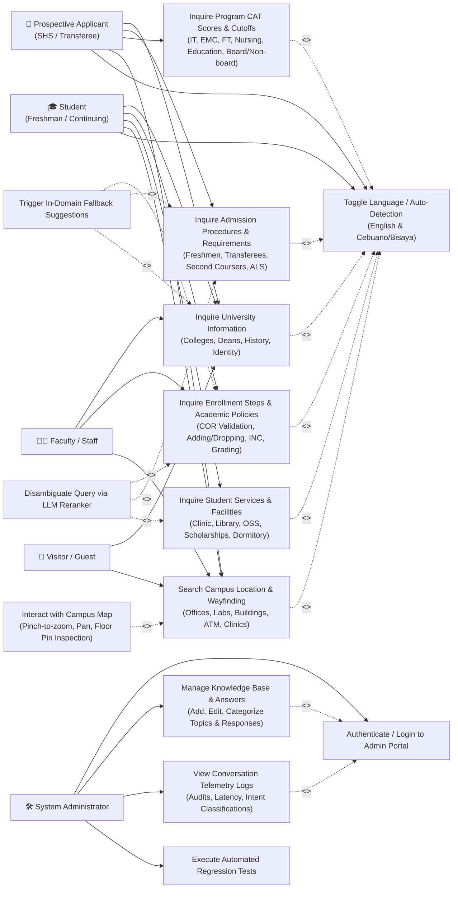

# BukSU AI Chatbot — Use Case Diagram & Actor Specifications

---

## 👥 1. Actors Specification

The BukSU AI Chatbot system recognizes five primary user actors and administrative roles interacting with the platform:

| Actor | Category | Description | Primary Goals |
| :--- | :--- | :--- | :--- |
| **🎓 Enrolled Student** | Primary End-User | Currently enrolled undergraduate or graduate students at BukSU (Freshmen, Continuing, Transferee, Graduating). | Inquire about grades, retention policies, enrollment schedules, ID replacement, clearance procedures, classroom locations, and student organizations. |
| **📝 Prospective Applicant** | Primary End-User | Senior High School (SHS) graduating students, ALS passers, second-coursers, or applicants inquiring from outside BukSU. | Learn about BukSU-CAT entrance exams, application requirements, program cut-off scores (IT, Nursing, Education, etc.), and admission dates. |
| **👨‍🏫 Faculty & Staff** | Secondary User | University professors, instructors, department chairpersons, and administrative office personnel. | Quickly check institutional policies, calendar dates, office directory contacts, room allocations, and student referral steps. |
| **🚶 Visitor / Campus Guest** | Secondary User | Parents, alumni, guests, contractors, and visiting researchers on the BukSU Main Campus. | Find office locations, navigation walking directions, campus landmarks, visitor guidelines, and parking areas. |
| **🛠️ System Administrator** | Administrative User | Capstone developers, university IT administrators, or designated knowledge management personnel. | Manage knowledge graph topics, edit bilingual response data, test query accuracy, review conversation telemetry logs, and manage user privileges. |

---

## 🎨 2. Use Case Diagram

---

## 📋 3. Detailed Use Case Specifications & Relationships

### Use Case 1: Inquire Program CAT Scores & Cutoffs
* **Primary Actor:** Prospective Applicant / Student
* **Description:** User asks about minimum entrance exam ratings or cutoff criteria for specific academic programs (e.g., BSIT, BSEMC, BSFT, BSN Nursing, BSEd Education, Accountancy).
* **Includes:** `Language Detection` (Detects if question is English or Bisaya, e.g., *"unsa ang required cat sa it"* vs. *"what is the required cat for IT"*).
* **Postconditions:** System delivers official percentage ranges or ATU contact guidance, with interactive buttons for ATU location and department inquiries.

---

### Use Case 2: Search Campus Location & Request Map Wayfinding
* **Primary Actor:** Student / Visitor / Faculty
* **Description:** User asks where a university facility, laboratory, clinic, or office is situated (e.g., *"where is ComLab 3"*, *"asa dapit ang clinic"*).
* **Includes:** `Language Detection`.
* **Extends:** `Interact with Campus Map` (When a location response is triggered, the system automatically sends coordinate matrices `[Y, X]`, floor metadata, access points, and walking routes to the visual map canvas).

---

### Use Case 3: Process Ambiguous Query (LLM Disambiguation)
* **Primary Actor:** System (Automated Internal Mechanism)
* **Trigger:** A student types an informal or slang query where Tier 2 semantic scoring produces candidates with $< 8.0$ points margin.
* **Extends:** Extends all inquiry use cases (`Ask Admission`, `Ask Enrollment`, `Ask Services`).
* **Postconditions:** The guarded cloud LLM selects the correct intent from the approved candidate pool without modifying or hallucinating response text.

---

### Use Case 4: Category-Isolated Fallback
* **Primary Actor:** System (Automated Safety Mechanism)
* **Trigger:** A user asks a question with zero semantic score in the active category, or an out-of-domain query.
* **Extends:** Extends all inquiry use cases.
* **Postconditions:** Delivers a polite category-specific message and renders 3 dynamic clickable topic discovery buttons.

---

### Use Case 5: Manage Knowledge Base (Admin CMS)
* **Primary Actor:** System Administrator
* **Description:** Administrator logs into the web CMS to create, edit, or categorize university topics, update bilingual answers, configure metadata trigger phrases, and attach map pins.
* **Includes:** `Authenticate / Login to Admin Portal` (Requires valid administrator credentials and JWT session).
