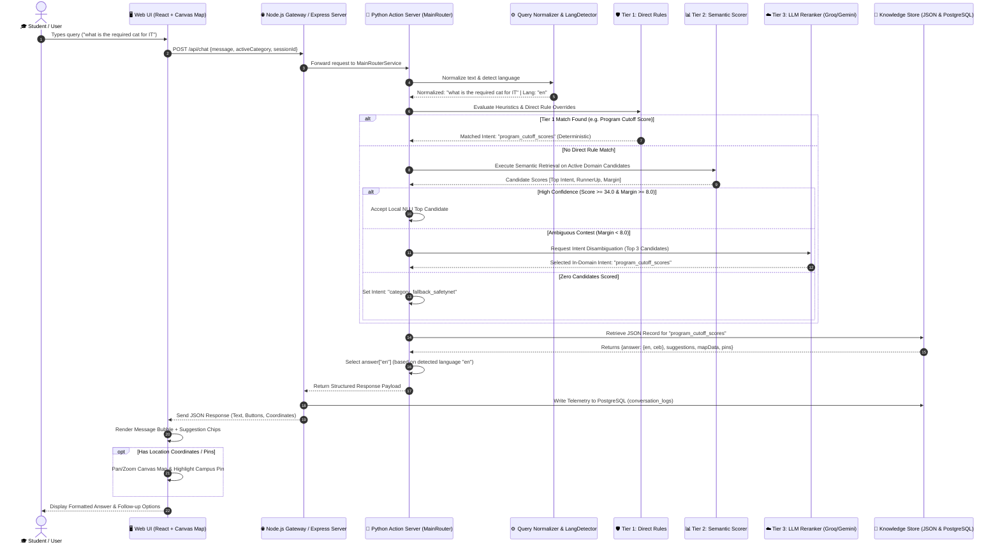

# BukSU AI Chatbot — Sequence Diagram & Execution Pipeline Order

---

## 📌 1. End-to-End Interaction Walkthrough

When a user submits a query (e.g., *"what is the required cat for IT"* or *"asa dapit ang clinic"*), the system executes a deterministic, multi-layer pipeline to sanitize, classify, rerank, and render the verified response.

Below is the sequence diagram and step-by-step pipeline execution order.

---

## 🔄 2. System Sequence Diagram

---

## 📑 3. Exact Pipeline Execution Order (Step-by-Step)

The internal execution order is strictly organized to prevent latency and guarantee accuracy:

### Step 1: Client Message Dispatch
* The user types a message or clicks a topic suggestion in the React UI.
* The frontend bundles the `user_message`, `active_category` slot, and `session_id`, transmitting it via REST POST (`/api/chat`) or WebSocket.

### Step 2: Gateway Intake & Session Verification
* The Express.js server receives the packet, checks session token validity, and forwards the payload to the Python Action Server (`MainRouterService`).

### Step 3: Text Sanitization & Normalization (`query_normalizer.py`)
* Cleans irregular characters, handles whitespace, and expands university acronyms:
  * Short acronyms like `IT` $\rightarrow$ `Information Technology / BSIT`
  * Acronyms like `COT` $\rightarrow$ `College of Technologies`, `COE` $\rightarrow$ `College of Education`, `ATU` $\rightarrow$ `Admission and Testing Unit`
* Normalizes Bisaya contractions (e.g., `unsay` $\rightarrow$ `unsa ang`, `pilay` $\rightarrow$ `pila ang`).

### Step 4: Language Classification (`language_detector.py`)
* Inspects word tokens against the centralized Cebuano lexicon (`asa`, `unsa`, `kinsa`, `pila`, `makasulod`, `kinahanglan`, etc.).
* Flags the session language as `ceb` (Cebuano/Bisaya) or `en` (English).

### Step 5: Tier 0 — Direct Payload Fast Path
* Checks if the message starts with `/direct_intent` or `/direct_topic`.
* If true, immediately extracts the target intent, bypassing all NLP processing ($\sim 0\text{ms}$).

### Step 6: Tier 1 — Deterministic Rule Evaluation (`knowledge_router.py`)
* Evaluates domain-isolated regex heuristics (e.g., CAT score lookups, dean queries, grading scale, dress code).
* Validates that the matched rule belongs to the current `active_domain` (rejects cross-category hijacking).
* If matched, proceeds directly to Step 9 ($\sim 1–5\text{ms}$).

### Step 7: Tier 2 — Semantic Candidate Scoring (`retrieval_scorer.py`)
* Scans all candidate intent records within the active domain.
* Calculates multi-factor feature points:
  * Exact phrase match: $+36.0\text{ pts}$
  * Subject noun match: $+18.0\text{ pts}$
  * Keyword token overlap: $+10.0\text{ pts}$
  * Intent purpose match: $+8.0\text{ pts}$
  * Purpose mismatch penalty: $-12.0\text{ pts}$
* Evaluates confidence thresholds:
  * **Score $\ge 34.0$ & Margin $\ge 8.0$:** Local NLU takeover ($\sim 5–15\text{ms}$).
  * **Score $< 34.0$ or Margin $< 8.0$:** Escalates to Tier 3.
  * **Score $= 0$:** Escalates to Safety Net Fallback.

### Step 8: Tier 3 — Guarded LLM Reranking (When Ambiguous)
* Dispatches a candidate selection prompt containing only the top 3–5 candidate intent keys to Groq LLaMA 3.3 (or Gemini fallback).
* The LLM chooses the single best intent key or returns `"None"`.
* If a valid candidate key is returned, proceeds to Step 9; otherwise, triggers Safety Net Fallback.

### Step 9: Knowledge Retrieval & Multilingual Resolution (`data_loader.py`)
* Fetches the official institutional JSON knowledge entry from `rasa/actions/knowledge/`.
* Extracts the response text corresponding to the detected language (`responses["en"]` or `responses["ceb"]`).
* Extracts suggestion button payloads, image URLs, coordinate arrays `[Y, X]`, and polyline walking vectors.

### Step 10: Telemetry Logging & Client Presentation
* Express gateway logs the conversation turn (query, intent, response time, detected language) into PostgreSQL (`conversation_logs`).
* React UI renders the text bubble, animates quick-reply chips, and updates the interactive canvas map if spatial coordinates are present.
