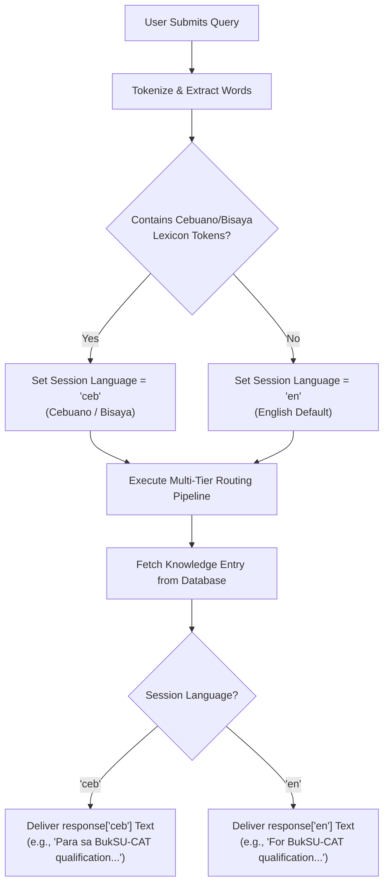
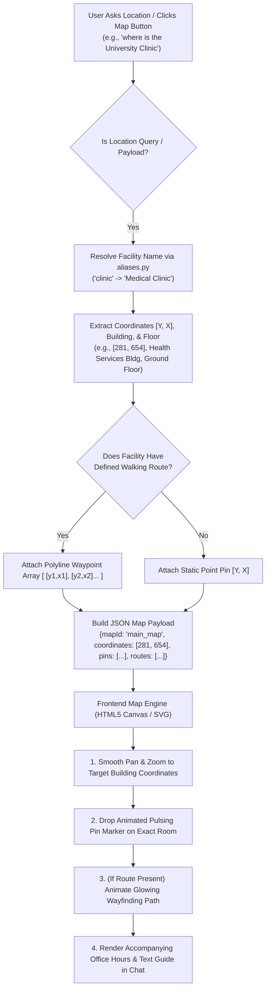
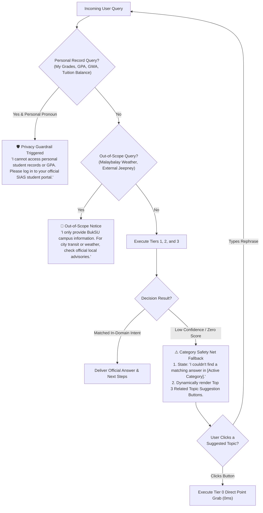

# BukSU AI Chatbot — Conversational & Dialogue Flow Charts

---

## 📌 1. Conversational Flow Overview

The dialogue system is structured around three primary branching flows:
1. **Bilingual Processing Flow:** Seamless automatic detection and routing between English and Cebuano/Bisaya.
2. **Campus Map Navigation Flow:** Spatial intent parsing, coordinate extraction, and interactive visual map rendering.
3. **Multi-Level Fallback & Guardrail Flow:** Graceful handling of out-of-domain, low-confidence, or private record inquiries.

---

## 🌐 2. Language Handling Flow (Bisaya vs. English)

### Mechanism: Automated Dynamic Language Detection
* The system does **not force manual language selection** via a dropdown, ensuring natural, fluid conversations.
* Every incoming message is dynamically analyzed by `language_detector.py` using token matching against a comprehensive Cebuano/Bisaya institutional lexicon (e.g., *asa, unsa, kinsa, kanus-a, pila, kinahanglan, makasulod, buhaton, adto, diri, nako*).
* If Cebuano tokens are detected, the session language is set to `ceb`; otherwise, it defaults to `en`.
* The final response generator selects the corresponding language string from the verified knowledge record (`responses["ceb"]` or `responses["en"]`).

---

## 🗺️ 3. Campus Map Navigation Request Flow

### Triggering Conditions:
1. **Spatial Keywords / Wh-Questions:** Queries containing *where is*, *asa dapit*, *location of*, *how to go to*, *directions to*.
2. **Facility / Office / Landmark Aliases:** Mention of specific campus rooms (e.g., *ComLab 1 to 12*, *Registrar Office*, *ATU*, *Clinic*, *Gymnasium*, *Library*, *Finance Building*, *ATM*).
3. **UI Quick-Reply Buttons:** Clicking `/direct_intent{"intent":"location_<Target>"}`.

---

## 🛡️ 4. Multi-Level Fallback & Guardrail Flow

When a user query cannot be decisively answered or touches protected information, the system routes through multi-tier safety nets rather than hallucinating.

---

## 📊 5. Summary of Conversational Policies

| Flow Scenario | Trigger / Condition | System Behavior | User Output |
| :--- | :--- | :--- | :--- |
| **Bilingual Query (English)** | English grammar / tokens | Sets `lang = 'en'` | English response text & English button labels |
| **Bilingual Query (Bisaya)** | Cebuano keywords (`asa`, `unsa`, etc.) | Sets `lang = 'ceb'` | Natural Cebuano response text |
| **Location Query** | Spatial tokens or building alias | Extracts `[Y, X]` coords + route | Text directions + animated canvas map pin/path |
| **Ambiguous Query** | Margin $< 8.0$ between candidates | Groq LLaMA 3.3 selects intent | Exact official response for the chosen intent |
| **Out-of-Category Query** | Zero score in active domain | Category fallback safety net | In-domain notice + 3 dynamic suggestion chips |
| **Personal Data Query** | *"what is my grade / balance"* | Privacy guardrail regex | Advises student to check SIAS portal directly |
| **Out-of-Scope Query** | City weather, jeepney routes | External guardrail regex | Advises student that bot is campus-specific |
