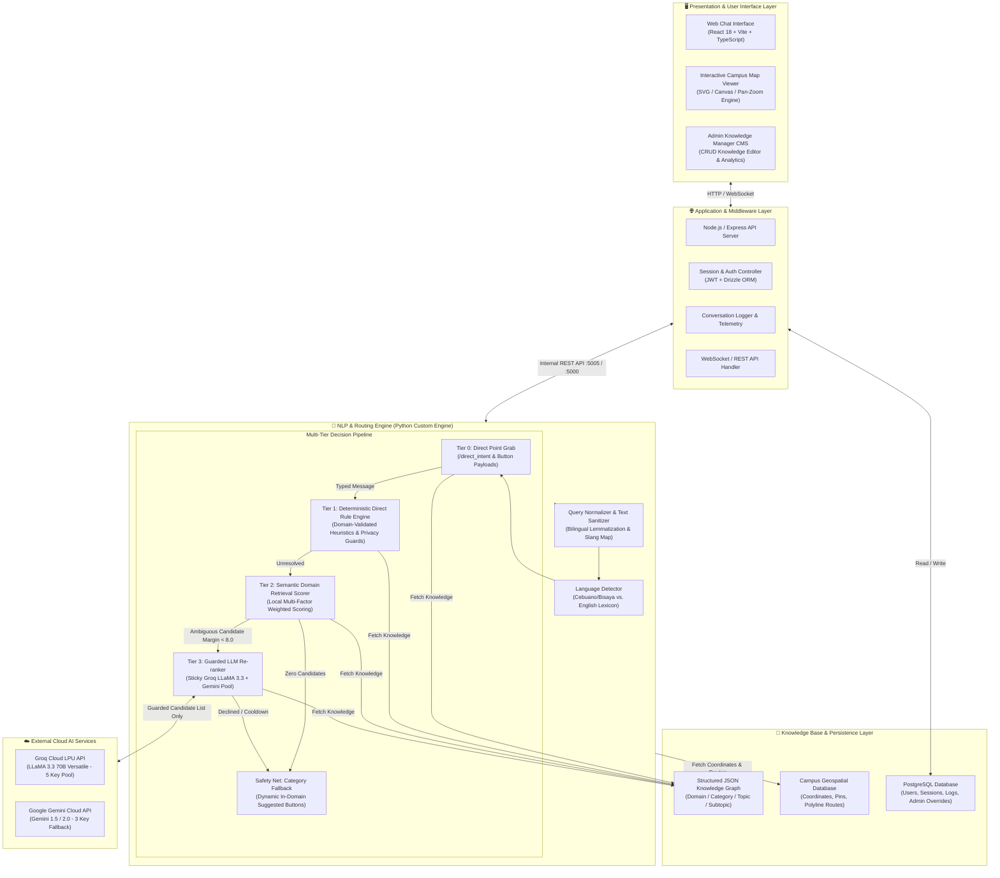
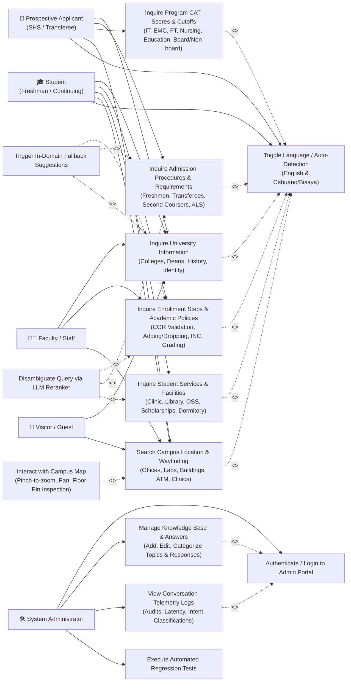
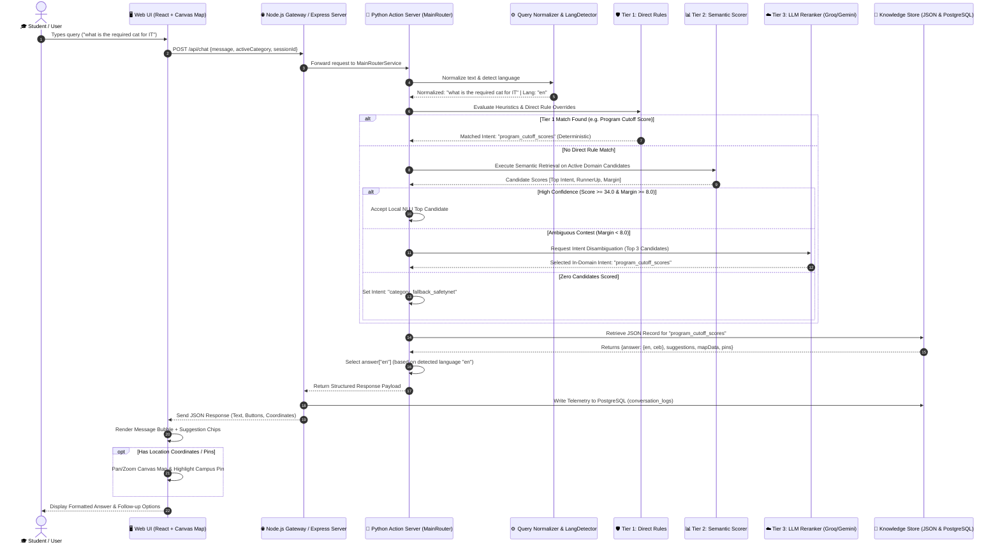
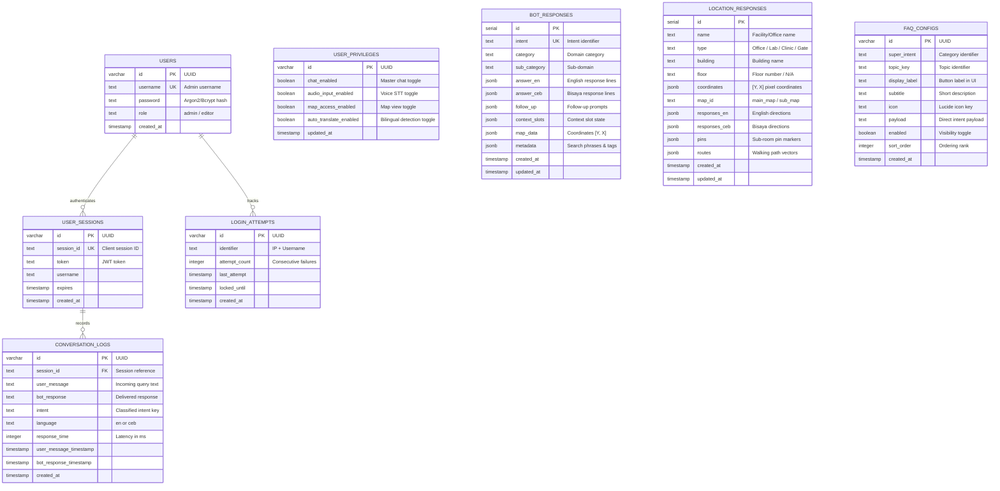
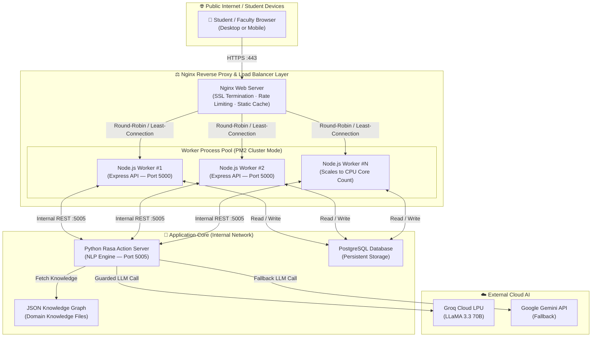

# Capstone Objective 1 — System Architecture, Flow, & Design Master Document

**Project Title:** BukSU AI Chatbot — High-Precision Bilingual Campus Conversational Agent & Navigation System  
**Objective:** Objective 1 — System Architecture, Use Case Modeling, Sequence Order, Conversational Flow, and Database/Knowledge Base Design  
**Status:** **100% Finalized & Complete**  
**Target Directory:** `docs/Architecture/Objective/`

---

## 📑 Table of Contents
1. [Objective 1 Executive Summary](#1-objective-1-executive-summary)
2. [System Architecture & Technology Stack](#2-system-architecture--technology-stack)
3. [Use Case Diagram & Actor Specifications](#3-use-case-diagram--actor-specifications)
4. [Sequence Diagram & Execution Pipeline Order](#4-sequence-diagram--execution-pipeline-order)
5. [Conversational & Dialogue Flow Charts](#5-conversational--dialogue-flow-charts)
6. [Database ERD & Knowledge Graph Schema](#6-database-erd--knowledge-graph-schema)
7. [System Design Finality & Defense Statement](#7-system-design-finality--defense-statement)
8. [Production Deployment Topology & Load Balancer Design](#8-production-deployment-topology--load-balancer-design)

---

## 📌 1. Objective 1 Executive Summary

The primary goal of **Objective 1** is to formulate, design, and validate the technical foundation of the BukSU AI Chatbot. The system is engineered around a **High-Precision Multi-Tier Hybrid Architecture** that seamlessly unifies:
* A modern reactive client with an interactive vector canvas campus map.
* A Node.js / Express middleware API gateway.
* A deterministic Python NLP action server with multi-factor semantic retrieval scoring.
* A guarded cloud Large Language Model (LLM) reranking pool for ambiguous queries with zero hallucination.
* A bilingual language processing core (English and Cebuano/Bisaya).
* A PostgreSQL relational database and structured JSON knowledge graph.

---

## 🏗️ 2. System Architecture & Technology Stack

### System Architecture Diagram



### Technology Matrix

| Layer | Component | Specific Technology | Purpose |
| :--- | :--- | :--- | :--- |
| **Frontend** | User Chat Widget | React 18, TypeScript, Tailwind CSS, Vite | Responsive conversational interface and quick discovery |
| **Frontend** | Interactive Map | HTML5 Canvas & SVG Vector Engine | Campus building pins, floor details, and walking paths |
| **Frontend** | Admin CMS | React, Radix UI, Lucide Icons | Knowledge base curation, response editing, telemetry |
| **Middleware** | Gateway Server | Node.js, Express.js, TypeScript | Session verification, request routing, rate limiting |
| **Database** | Relational Store | PostgreSQL + Drizzle ORM | Audit logs, session tokens, administrative credentials |
| **NLP Core** | Routing & Action Server | Python 3.10, Rasa Open Source | Normalization, language classification, scoring pipeline |
| **NLP Core** | Semantic Scorer | Custom Multi-Factor Retrieval Scorer | In-domain candidate matching with $+36/+18/+8/-12$ weighting |
| **External AI** | Primary LLM Reranker | Groq LPU (LLaMA 3.3 70B Versatile) | Sub-300ms ambiguous query intent selection |
| **External AI** | Fallback LLM Reranker | Google Gemini 1.5 / 2.0 Flash API | Automated fallback pool for rate limits |
| **Knowledge** | Knowledge Graph | Typed JSON Trees (`knowledge/`) | Single source of truth for official university answers |

---

## 👥 3. Use Case Diagram & Actor Specifications



---

## 🔄 4. Sequence Diagram & Execution Pipeline Order



### Exact Order of Internal Steps:
1. **Client Submission:** React UI captures message, category slot, and session ID.
2. **Gateway Intake:** Node.js Express server validates session and forwards to Python server.
3. **Query Normalization:** `query_normalizer.py` sanitizes text, normalizes contractions, and expands acronyms (IT $\rightarrow$ BSIT, COT $\rightarrow$ College of Technologies).
4. **Language Classification:** `language_detector.py` checks for Cebuano/Bisaya lexicon markers and sets session language to `ceb` or `en`.
5. **Tier 0 Fast Path:** Detects `/direct_intent` or button clicks ($\sim 0\text{ms}$).
6. **Tier 1 Heuristic Rules:** Executes domain-validated regex rules for high-frequency topics ($\sim 1–5\text{ms}$).
7. **Tier 2 Semantic Scoring:** Ranks in-domain candidates using multi-factor scoring. Takes over locally if score $\ge 34.0$ and margin $\ge 8.0$ ($\sim 5–15\text{ms}$).
8. **Tier 3 Guarded LLM Reranking:** If margin $< 8.0$, Groq LLaMA 3.3 selects the best intent from pre-screened candidates without generating text ($\sim 250\text{ms}$).
9. **Knowledge Graph Fetch:** Pulls official response text matching detected language (`en`/`ceb`), suggestion chips, map coordinates, and walking routes.
10. **Telemetry & Client Render:** Logs conversation metrics into PostgreSQL and renders chat message bubble, buttons, and animated campus map pin.

---

## 🌐 5. Conversational & Dialogue Flow Charts

### Bilingual Processing Flow
* **Automatic Detection:** Every message is analyzed per-turn using token matching against a Cebuano stopword lexicon.
* **Persistent Flexibility:** A student can freely switch between English and Bisaya mid-conversation without needing to restart the session or toggle settings manually.

### Map Navigation Flow
* **Spatial Triggers:** Activated by location questions (*"where is"*, *"asa dapit"*), building names (*ComLab 1-12*, *Clinic*, *Registrar*), or clicking location buttons.
* **Interactive Output:** Delivers textual office directions, floor metadata, and triggers animated pan-and-zoom map positioning with waypoint walking routes on the client canvas.

### Multi-Level Fallback & Guardrails
* **Personal Data Guard:** Blocks queries asking for private grades or tuition balances and redirects the student to the official SIAS portal.
* **Out-of-Scope Guard:** Rejects external city weather or general transit inquiries not related to BukSU campus operations.
* **Category Safety Net:** When confidence is zero, outputs a polite domain-scoped message and renders 3 dynamic clickable topic discovery buttons.

---

## 🗄️ 6. Database ERD & Knowledge Graph Schema



---

## 🔒 7. System Design Finality & Defense Statement

### Panel Question:
> *"Is the system's design (architecture, flow, database schema) finalized, or does it still depend on the data we're collecting?"*

### Capstone Defense Answer & Position:
1. **The Architecture, Decision Flow, and Database Schema are 100% Finalized:**
   * The multi-tier hybrid pipeline, query normalization layer, language detection mechanism, relational PostgreSQL tables, and JSON knowledge graph architecture are fully locked and structurally complete.
2. **Data Scalability Without Structural Changes:**
   * Incoming institutional data (e.g., additional FAQ training phrases, revised department hours, or new program requirements) is populated directly into the dynamic JSON knowledge graph without modifying the underlying database schema or routing logic.
3. **Objective 1 Status:**
   * **Objective 1 can be presented to the Capstone panel as 100% COMPLETE.**

---

## 🚀 8. Production Deployment Topology & Load Balancer Design

### 8.1 Deployment Justification & Traffic Estimation

The BukSU AI Chatbot is designed not only as a capstone prototype but as a system intended for real institutional deployment after the defense. Based on projected usage patterns of the Bukidnon State University student population, the following traffic tiers are anticipated:

| Traffic Scenario | Estimated Concurrent Users | Trigger Event |
| :--- | :---: | :--- |
| **Common Day** | 100 – 300 users | Regular academic day queries |
| **Rush Hour / Exam Week** | 1,000 – 1,500 users | Pre-exam and schedule inquiry surges |
| **Enrollment Day (Peak Load)** | 5,000 – 10,000 users | University-wide enrollment opening |

A single-process Node.js server cannot safely absorb these concurrent loads without risking port exhaustion, unhandled socket timeouts, and memory overflow. The **Nginx Reverse Proxy / Load Balancer** layer is introduced to ensure the chatbot remains reliably available under all three traffic conditions.

---

### 8.2 Production Deployment Architecture Diagram



---

### 8.3 Nginx Layer — Responsibilities

| Nginx Function | Description |
| :--- | :--- |
| **SSL/TLS Termination** | Handles HTTPS encryption/decryption at the edge so internal workers communicate over plain HTTP, reducing CPU overhead on Node.js processes. |
| **Load Balancing** | Distributes incoming HTTP connections across multiple PM2-managed Node.js worker processes using round-robin or least-connection algorithm. |
| **Static Asset Caching** | Serves the React frontend build (`/dist`) directly from disk without passing requests through Node.js, dramatically reducing server load. |
| **Rate Limiting** | Enforces per-IP request rate limits (e.g., 20 req/sec) to prevent abuse and protect the LLM API key pool from single-source exhaustion. |
| **Connection Buffering** | Buffers slow client uploads so Node.js workers are never blocked waiting for a slow mobile connection to finish sending a request. |
| **Health Check Proxy** | Routes to healthy workers only; if a Node.js worker crashes, PM2 restarts it while Nginx automatically bypasses it during recovery. |

---

### 8.4 PM2 Cluster Mode — Node.js Worker Management

The Node.js API server is managed by **PM2** in cluster mode, which forks one worker process per available CPU core:
- Handle multiple concurrent WebSocket connections simultaneously.
- Avoid blocking the event loop — if one worker is busy on an LLM call, others continue accepting connections.
- Automatically restart crashed workers within milliseconds without taking the service offline.

```
PM2 Cluster: 4–8 Worker Processes (depending on server CPU cores)
Each Worker:  ~512MB RAM allocation | ~250 concurrent connections
Total Capacity: ~1,000–2,000 concurrent connections per server node
```

---

### 8.5 Capacity Justification for BukSU Scale

The anticipated **10,000 peak enrollment-day users** does not mean 10,000 simultaneous open connections. Chatbot queries are short, stateless request-response cycles averaging **2–5 seconds per round trip**. At any given moment, actual concurrent active connections are a fraction of the total daily user count.

- **Common Day (100–300 users):** A single worker process is sufficient; Nginx overhead is negligible.
- **Rush Hour (1,000–1,500 users):** PM2 cluster with 4 workers handles this comfortably with headroom.
- **Enrollment Day (5,000–10,000 users):** Nginx connection buffering + rate limiting prevents overload. PM2 auto-scales within the server's core count. For extreme peaks, a second identical server node can be added behind Nginx with **zero application code changes**.

> **Note:** The current capstone prototype operates in a development configuration (single Node.js process, no Nginx). The production deployment topology described in this section represents the planned post-defense institutional deployment architecture, documented here for completeness and academic defense purposes.
