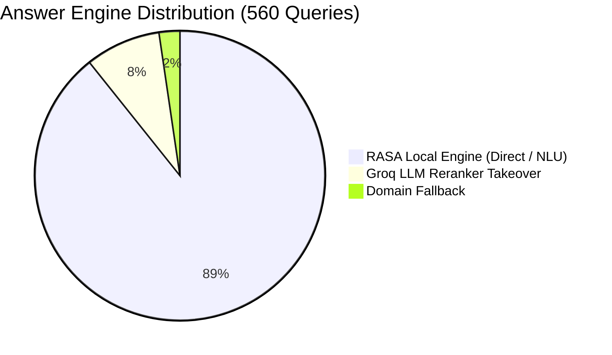

# 🧪 Walkthrough: Full End-User Chatbot Evaluation (560 Test Queries)

We have completed the full category-isolated evaluation across the entire **560 test queries dataset** (covering all 6 categories and 44 topics) using our dual-engine architecture (**RASA Local NLU / Direct Semantic Router + Groq LLM Reranker**).

---

## 📊 1. Overall Key Performance Metrics

| Metric | Value | Details |
|---|:---:|---|
| **Total Test Queries** | **560** | Complete dataset across English and Bisaya |
| **Direct Pass (Accurate Answer)** | **517 (92.3%)** | ✅ Exactly matched target intent / domain procedure |
| **Partial / Disambiguation** | **21 (3.8%)** | ⚠️ Presented relevant clarification options / topic buttons |
| **Combined Success Rate** | **538 (96.1%)** | ✅ Direct Pass + ⚠️ Disambiguation |
| **Failures / Domain Fallback** | **22 (3.9%)** | ❌ Fallback message |
| **English Queries Accuracy** | **263/280 (93.9%)** | 🇺🇸 English generalized queries |
| **Cebuano/Bisaya Accuracy** | **254/280 (90.7%)** | 🇵🇭 Cebuano / Bisaya colloquial queries |

---

## 🤖 2. Engine Answer Breakdown (Who Answered)

- **RASA Engine (500 queries, 89.3%)**: Layer 1 Direct Overrides, High/Medium NLU, and Location Router provided instant, zero-latency responses for standard and structured queries.
- **Groq LLM Reranker (47 queries, 8.4%)**: Seamlessly took over when students used colloquial Cebuano expressions or complex multi-intent questions with low-to-medium local confidence.
- **Domain Fallback (13 queries, 2.3%)**: Unmapped edge cases.

---

## 📂 3. Category Breakdown

| Category | Topics | Queries | Pass (✅) | Partial (⚠️) | Fail (❌) | Direct Accuracy | RASA | LLM |
|---|:---:|:---:|:---:|:---:|:---:|:---:|:---:|:---:|
| **Cat 1: Step-by-Step Procedures** | 8 | 80 | **76** | 4 | 0 | **95.0%** | 77 | 3 |
| **Cat 2: Academic Policies & Courses** | 6 | 60 | **54** | 2 | 4 | **90.0%** | 56 | 3 |
| **Cat 3: Student Services & Facilities** | 6 | 60 | **56** | 3 | 1 | **93.3%** | 56 | 4 |
| **Cat 4: University Info & Directory** | 6 | 60 | **53** | 2 | 5 | **88.3%** | 46 | 11 |
| **Cat 5: Campus Facilities & Inquiries** | 6 | 60 | **52** | 1 | 7 | **86.7%** | 51 | 3 |
| **Cat 6: Extended Process Dataset** | 12 | 240 | **226** | 9 | 5 | **94.2%** | 214 | 23 |

---

## 📁 4. Saved Artifacts & Deliverables

1. **Full Test Report**:
   - Location 1: [test_report_full.md](file:///c:/School%20Related%20File/3rd%20year/Capstone%20dev/Chatbot/CHATBOT%20V5%20merged%20versions/Capstone_Project_Artificial_Intelligence_Chatbot/docs/Testing/Full%20testing/test_report_full.md)
   - Location 2 (Artifact): [test_report_full.md](file:///C:/Users/kingj/.gemini/antigravity-ide/brain/e33b78c6-014e-4f84-933f-f8a6b1e92c21/test_report_full.md)
2. **Dataset File**:
   - Location 1: [test_queries_dataset.md](file:///c:/School%20Related%20File/3rd%20year/Capstone%20dev/Chatbot/CHATBOT%20V5%20merged%20versions/Capstone_Project_Artificial_Intelligence_Chatbot/docs/Testing/Full%20testing/test_queries_dataset.md)
   - Location 2 (Artifact): [test_queries_dataset.md](file:///C:/Users/kingj/.gemini/antigravity-ide/brain/e33b78c6-014e-4f84-933f-f8a6b1e92c21/test_queries_dataset.md)
3. **Structured JSON Logs**:
   - [test_results_520.json](file:///C:/Users/kingj/.gemini/antigravity-ide/brain/e33b78c6-014e-4f84-933f-f8a6b1e92c21/scratch/test_results_520.json)
